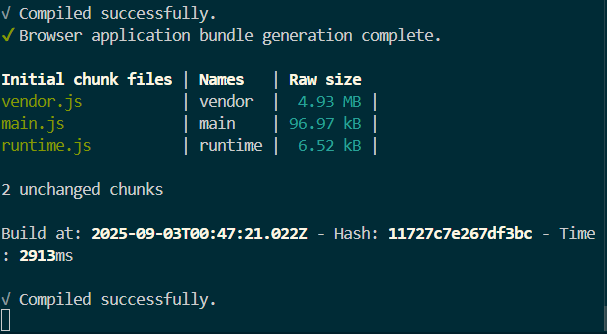
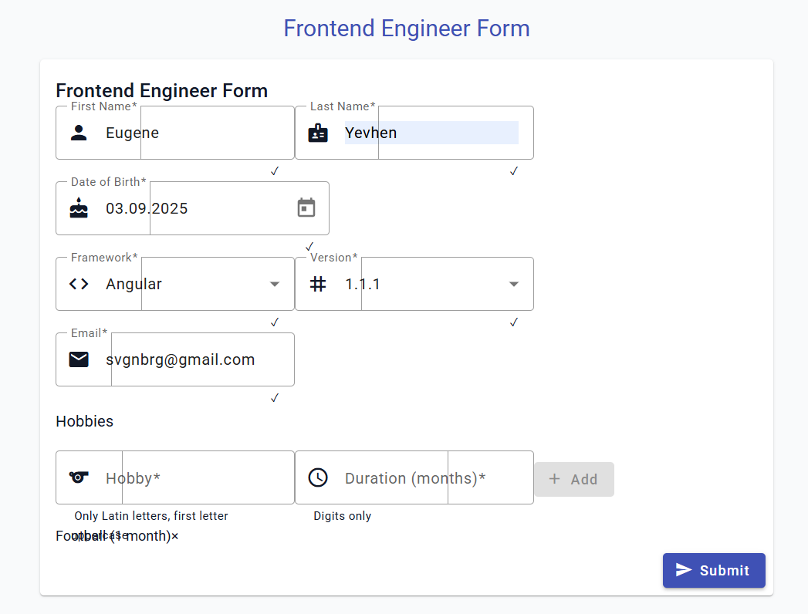

# Frontend Engineer Form

This is a responsive form built with Angular and Angular Material that collects information about frontend engineers, including their personal details, framework experience, and hobbies.

## Features

- Reactive form with validation
- Responsive design that works on mobile and desktop
- Dynamic framework version selection based on the selected framework
- Email availability check
- Hobbies management with add/remove functionality
- Form submission with proper data formatting

## Prerequisites

- Node.js (v16 or later)
- npm (v8 or later) or Yarn
- Angular CLI (v17 or later)

## Installation

1. Clone the repository:
   ```bash
   git clone github.com:soewal19/AngularTestTaskAtumn2025ITeam.git
   cd frontend-engineer-form
   ```

2. Install dependencies:
   ```bash
   npm install
   ```

   or if you're using Yarn:
   ```bash
   yarn install
   ```

## Development server

Run `ng serve` for a dev server. Navigate to `http://localhost:4200/`. The application will automatically reload if you change any of the source files.

## Build

Run `ng build` to build the project. The build artifacts will be stored in the `dist/` directory.

## Running Tests

### Unit Tests

Run the unit tests with code coverage report:

```bash
# Run all unit tests
ng test

# Run tests with code coverage
ng test --code-coverage

# Run tests in watch mode
ng test --watch=true

# Run a specific test file
ng test --include=**/engineer-form.component.spec.ts
```

### End-to-End Tests

Run the end-to-end tests using Cypress:

```bash
# Start the application in development mode
ng serve

# In a separate terminal, run Cypress
npx cypress open

# Or run headless tests
npx cypress run
```

### Test Coverage

After running tests with coverage, open the coverage report:

```bash
# Open the coverage report in your default browser
start coverage/frontend-engineer-form/index.html
```

## Test Structure

- Unit tests: `*.spec.ts` files next to each component/service
- E2E tests: `cypress/e2e/*.cy.ts`
- Test utilities: `src/test.ts` and `cypress/support/`

Run `ng e2e` to execute the end-to-end tests via a platform of your choice.

## Deployment

### Netlify

1. Push your code to a Git repository (GitHub, GitLab, or Bitbucket).
2. Log in to your Netlify account and click on "New site from Git".
3. Select your Git provider and repository.
4. Configure the build settings:
   - Build command: `npm run build`
   - Publish directory: `dist/frontend-engineer-form`
5. Click "Deploy site".

### Vercel

1. Install Vercel CLI: `npm install -g vercel`
2. Run `vercel` in the project directory and follow the prompts.

## Project Structure

```
src/
├── app/
│   ├── engineer-form/           # Main form component
│   │   ├── engineer-form.component.ts
│   │   ├── engineer-form.component.html
│   │   └── engineer-form.component.scss
│   ├── app.component.ts         # Root component
│   ├── app.module.ts            # Root module
│   └── app-routing.module.ts    # Routing configuration
├── assets/                      # Static assets
├── environments/                # Environment configurations
└── styles.scss                  # Global styles
```

## Form Fields

1. **Name** (required, min 2 characters)
2. **Last Name** (required, min 2 characters)
3. **Date of Birth** (required)
4. **Framework** (required, select from Angular/React/Vue)
5. **Framework Version** (enabled after selecting a framework)
6. **Email** (required, must be valid, checks for availability)
7. **Hobbies** (at least one required, with name and duration)

## Known Issues

- Email availability check is currently simulated in the frontend.
- Date format is fixed to DD-MM-YYYY for the API submission.


- Email availability check is currently simulated in the frontend.
- Date format is fixed to DD-MM-YYYY for the API submission.


## Show result



## Show result in Browser




## License

This project is licensed under the MIT License - see the [LICENSE](LICENSE) file for details.
